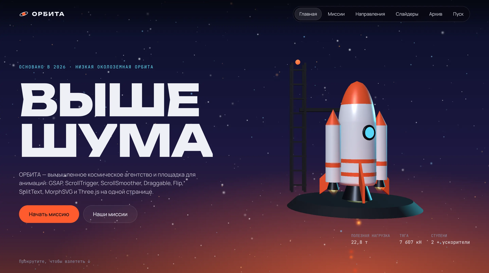
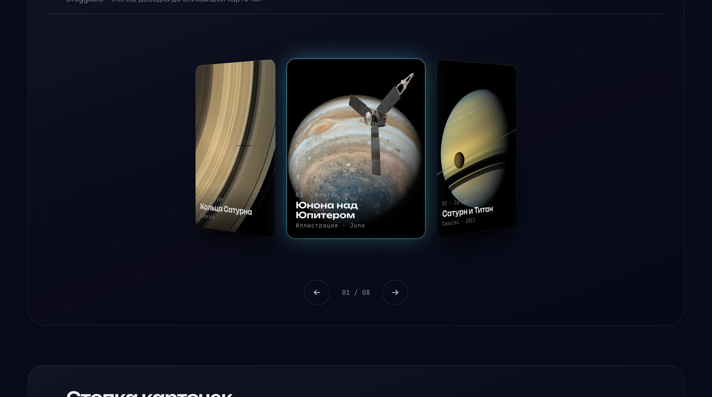
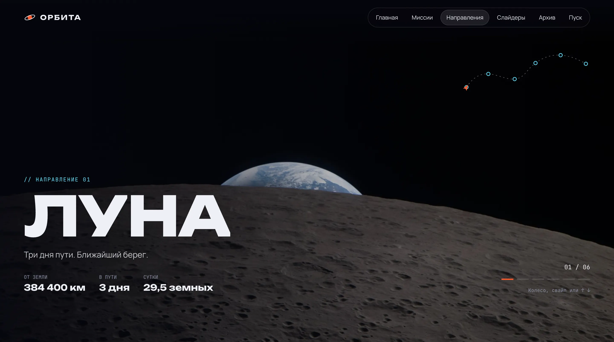

<div align="center">

<a href="https://dmitriy9427.github.io/space-agency/"></a>

# 🚀 ОРБИТА

**Сайт вымышленного космического агентства — все 16 плагинов GSAP, three.js и шейдеры**

### [Открыть демо →](https://dmitriy9427.github.io/space-agency/)

      [](https://github.com/dmitriy9427/space-agency/actions/workflows/pages.yml)

</div>

| Слайдеры | Направления |
| --- | --- |
|  |  |

## Коротко

| | |
| :---: | --- |
| 🚀 | **3D-ракета** — летит по скроллу, three.js с ленивой загрузкой |
| ✨ | **Все плагины GSAP** — ScrollTrigger, SplitText, Flip, Draggable, MorphSVG… — с объяснением в docs |
| 🌀 | **Шейдерные переходы** — между страницами, без перезагрузки |
| 💧 | **Вода на GPU** — симуляция ряби в шейдере |
| ♾ | **Бесконечная галерея** — фото NASA, драг и инерция |
| 📚 | **Документация** — учебник по проекту и README в каждом модуле, 205 тестов |

Автор — [Дмитрий Рябов](https://dmitriy9427.github.io/resume/), frontend-разработчик.

---

> **Есть мобильная версия:** меню-бургер, своя траектория ракеты для телефона, жесты не мешают прокрутке. Что и как сделано — [docs/11-mobile.md](docs/11-mobile.md).

```bash
npm install
npm run dev        # http://localhost:5173
npm test           # 200+ тестов (Vitest + jsdom)
npm run coverage   # тесты с покрытием
npm run build      # сборка всех страниц в dist/
```

`?debug` в адресе показывает FPS, худший кадр и draw calls ракеты, а в консоли становится доступен `window.__orbita`.

## Документация

**Начните с [docs/README.md](docs/README.md).** Это учебник по проекту: базовые понятия с нуля, все плагины GSAP, архитектура, перенос на React/Vue/Next/Astro, рецепты, производительность, тесты, частые проблемы, мобилка, словарь.

Кроме того:

- **README в каждой папке модуля**: как работает эффект, почему так, все настройки, разметка, перенос, мобилка;
- **комментарии в каждом файле кода**: в начале файла — «что это и зачем», у неочевидных строк — «почему».

## Страницы и эффекты

| Страница | Что на ней |
| --- | --- |
| **Главная** (`index.html`) | 3D-ракета по скроллу (взлёт → разворот носом вниз → уход за край → возврат → посадка на станцию), буквы заголовка, слова по скроллу, закреплённая история, SVG-орбита (DrawSVG, MotionPath, MorphSVG), 6 кастомных слайдеров, водная гладь на GPU, бесконечный архив с лайтбоксом, центр управления с пуском |
| **Миссии** (`missions.html`) | Заголовок по строкам, горизонтальная лента миссий от вертикального скролла (`containerAnimation`), фильтр снимков на Flip |
| **Направления** (`destinations.html`) | Полноэкранные слайды планет (колесо, свайп, стрелки через Observer), маршрут с корабликом (MotionPath) |
| **Везде** | Переходы между страницами без перезагрузки: шейдерный «занавес». Неоновый курсор-«тянучка» с подсказками, магнитные кнопки, шапка |

Слайдеры главной:

1. 3D-кольцо (Draggable + Inertia);
2. стопка карточек;
3. бесконечная лента;
4. WebGL-барабан;
5. видеолента с роликами NASA;
6. шейдерный переход на всю ширину в 4 направлениях.

## Устройство в двух словах

```
index.html / missions.html / destinations.html   вёрстка; эффекты включаются атрибутом data-module="имя"
src/main.js        список модулей
src/app.js         общий слой + страницы + переходы
src/core/          общие инструменты (GSAP, реестр модулей, роутер, шина событий, уборка, математика…)
src/content/       данные (фото, видео, миссии, планеты) и шаблоны карточек
src/modules/<имя>/ эффекты: чистая логика + подключение + (WebGL-сцена) + README + тесты
src/styles/        CSS
public/photos/     фото NASA (авторство — CREDITS.md)
```

Каждый эффект — модуль с контрактом `init(element, ctx) → { destroy() }`. Поэтому любой эффект можно взять отдельно и перенести в другой проект ([docs/06-porting.md](docs/06-porting.md)).

## Производительность

Chrome, 1440×900, DPR 2: **120 fps во всех секциях**, худший кадр около 10 мс. Как это достигнуто и как проверить — [docs/08-performance.md](docs/08-performance.md).

## Фото и видео

Медиатека NASA. Авторство — [CREDITS.md](CREDITS.md) и подвал сайта. Видео в репозитории нет: лёгкие `~mobile.mp4` стримятся с images-assets.nasa.gov при наведении на карточку.
